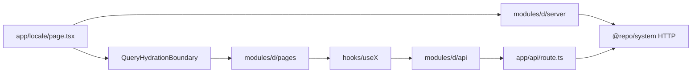

# Design patterns

Hybrid of Vercel `src/` + feature folders + one-way imports. **Not** full Feature-Sliced Design (no six layers). **Not** atomic design. No global store.

## Data flow (live-data pages)



Browser talks to **this origin** (`/api/...`). Only the server talks to the upstream API.

## 1. Thin route

`src/app/[locale]/**/page.tsx` does locale, metadata, JSON-LD, and composition. Domain UI stays in the module.

Typical route work:

- `hasLocale` + `setRequestLocale`
- `generateMetadata` via a shared helper (e.g. `buildPageMetadataFromParams`)
- Optional JSON-LD breadcrumb from `@/shared/seo`
- Render `<ModulePage />` (optionally inside `QueryHydrationBoundary`)

## 2. Two data-fetch paths

### A. RSC seed + hydrate (lists, search, CMS)

1. Route is `dynamic = "force-dynamic"` when the payload must stay fresh.
2. `loadXPageSeed` uses `getQueryClient()`, `prefetchQuery`, `dehydrate`.
3. Route wraps the module page in `QueryHydrationBoundary`.
4. Client hooks use the **same** `queryKeys` and hydrated options (`staleTime: Infinity`, `refetchOnMount: false`).
5. Later client fetches go through `modules/<d>/api/*Client.ts` → BFF.

Prefetch failures are logged; seed still returns so the page can render empty/error UI.

### B. Direct server fetch (mostly static pages)

Module page (Server Component) calls `loadXPageData`. No Query hydration. Failures usually degrade to empty UI rather than throwing the route.

## 3. BFF adapter

`src/app/api/**/route.ts` is thin:

```ts
export async function GET(request: NextRequest) {
	return handleApiGet(request, (locale) => fetchWidgets(locale));
}
```

Shared helper parses locale (`?locale=` or `Accept-Language`, then default) and maps upstream errors to JSON.

Client fetchers `fetch` `/api/...`, then parse with Zod (`parseBffResponse`). Zod is for **API responses**, not forms.

Mutations (when the product needs them): same BFF pattern with `POST`/`PATCH`/`DELETE` in `route.ts`, still no upstream URL in the browser.

## 4. Query hook + hierarchical keys

```ts
queryKey: queryKeys.widgets.list(locale)
queryFn: () => fetchWidgetsClient(locale)
```

Keys live in `@repo/system/query/keys` under `["<app>", ...]`. Locale is part of the key when the payload is localized.

Data hooks: `useWidgets`. UI/controller hooks: `useWidgetsController` (owns selection + queries; presentational components stay dumb).

## 5. Query state machine

`src/shared/query/QuerySectionState.tsx`: Loading → Error → Empty → Content.

Pass the module `*Skeleton` as `loading`. Shared error UI is the default error branch.

Optional: prefetch on hover/link intent for heavy list routes.

## 6. Composition over inheritance

- **Pages compose sections** — the page file only mounts sections
- **Shells:** site chrome (`SiteShell`), product-detail shell, system chrome (loading/error/404)
- **Grid:** `Container` / `Row` / `Col` (12-col, logical offsets)
- **Providers:** `src/providers/index.tsx` nests Query (+ any app providers). Add providers here, not in every layout
- **Domain context is local** — a slice context is fine; a global store is not the default

## 7. Lazy islands

Heavy client-only widgets (carousel, map, editor): `next/dynamic({ ssr: false })` via `*Lazy.tsx`.

## 8. i18n as a layer

- `src/i18n/routing.ts` — locales and default from the **product**
- `src/i18n/navigation.ts` — `createNavigation(routing)` → `Link`, `redirect`, `usePathname`, `useRouter`, `getPathname`
- `src/i18n/request.ts` — loads namespace JSON files (`Promise.all`)
- One JSON file per domain per locale: `src/i18n/messages/<locale>/<domain>.json`
- Server pages: `getTranslations`; client widgets: `useTranslations`

## 9. Server / client split

| Default | Server Component |
| --- | --- |
| `"use client"` | Hooks, interactive widgets, error boundaries, `QuerySectionState` |
| `import "server-only"` | `modules/<d>/server/**`, `@repo/system` upstream fetchers |

Route `page.tsx` and most `modules/*/pages/*.tsx` stay async Server Components.

## 10. Skeletons as siblings

`*Skeleton` matches the live section layout. Route `loading.tsx` and query `loading` slot both import it.

## 11. Shared kernel packages

`@repo/system` = HTTP + query + providers. `@repo/utils` = pure. `@repo/icons` = icon set. Do not duplicate `cn`, query keys, or upstream fetch inside a module.

## 12. Testing colocation

Pure utils next to the util. App flows in `src/__tests__/`. Package contracts in `packages/<pkg>/src/**/__tests__/`.

## Anti-patterns

- Upstream API URL in client components
- Business logic in `page.tsx`
- Re-exporting `server/` from the module root barrel
- Folder-as-component landings as the default module shape
- `src/lib` dumping ground
- Zustand for ordinary page UI
- `next/link` and physical `ml-*` / `text-left` for directional layout
- Full FSD `entities/features/widgets` vocabulary
- Per-domain npm packages (`@repo/faq`) — keep platform code in `@repo/system`
